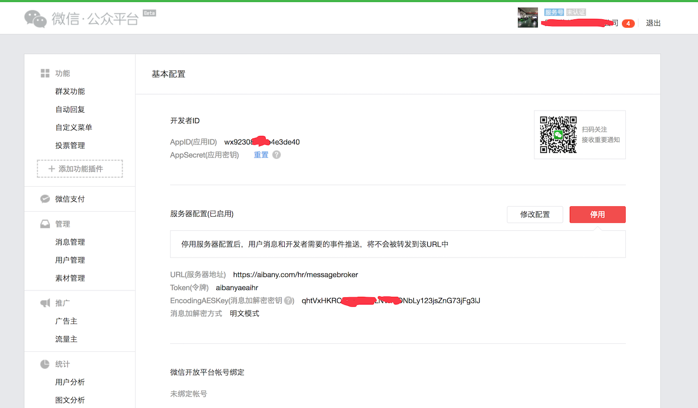
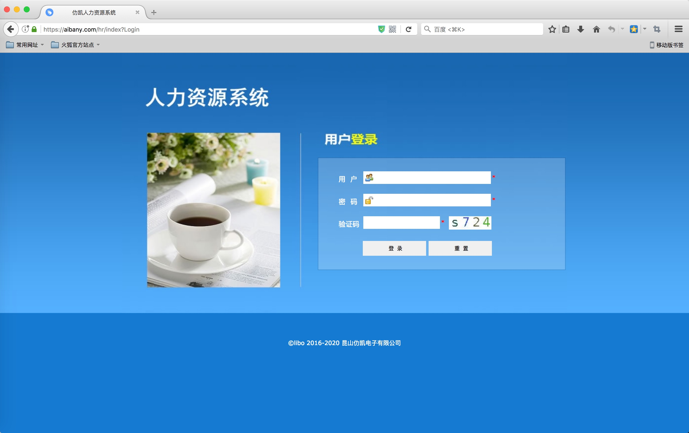
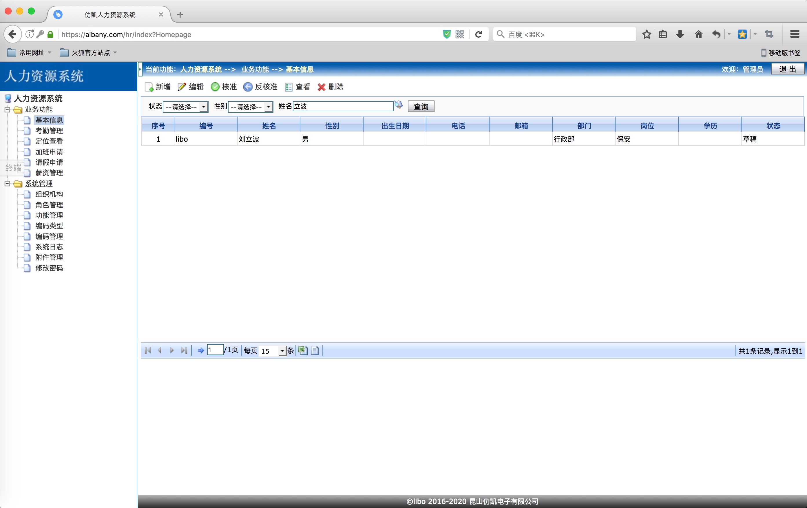
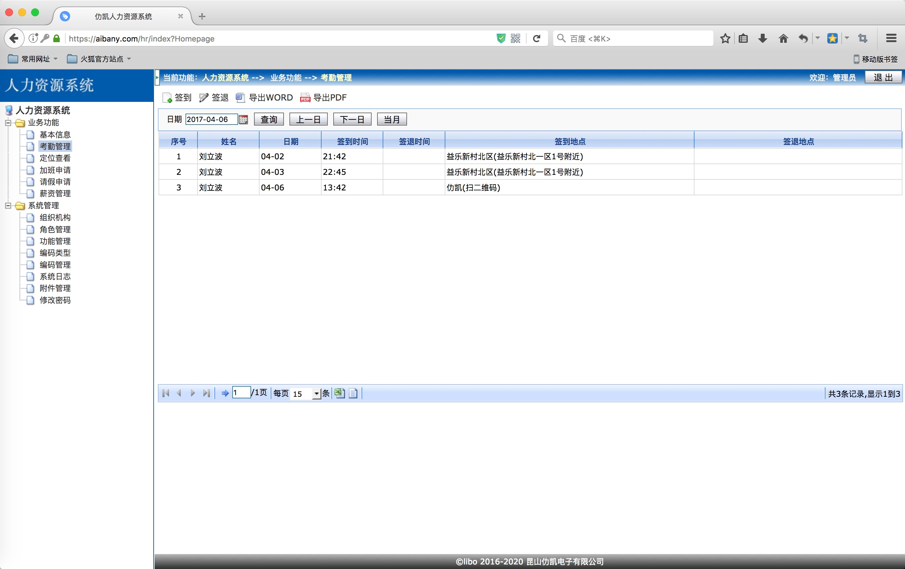
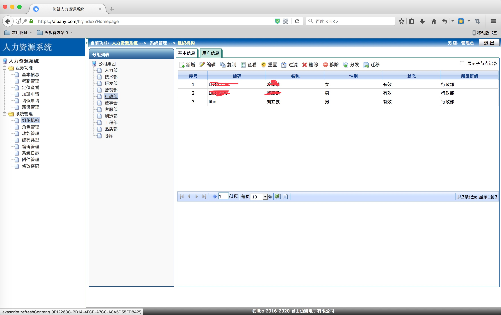
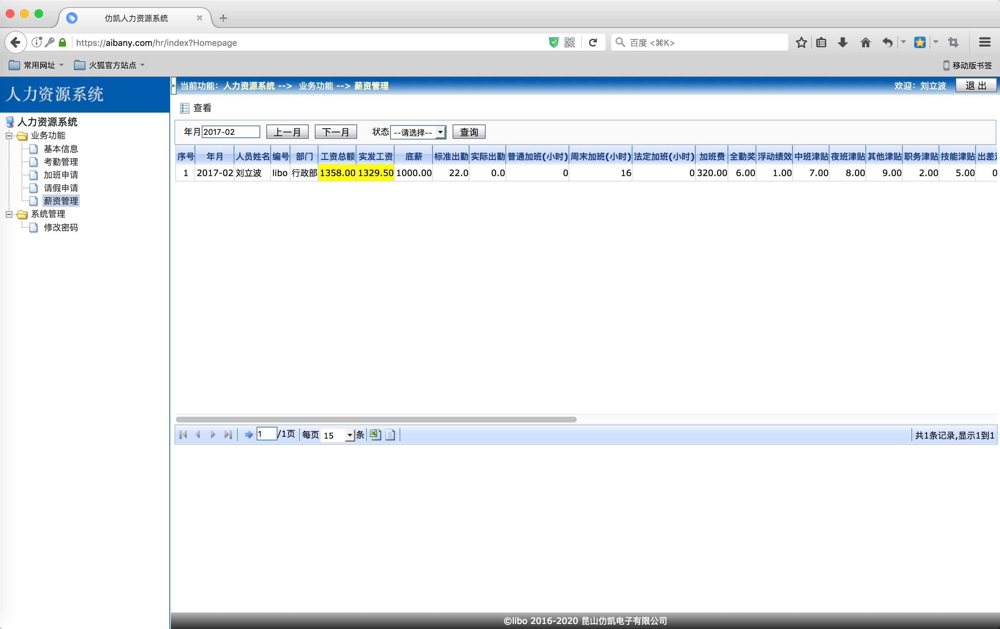
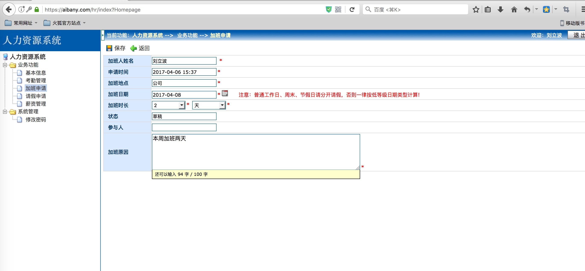
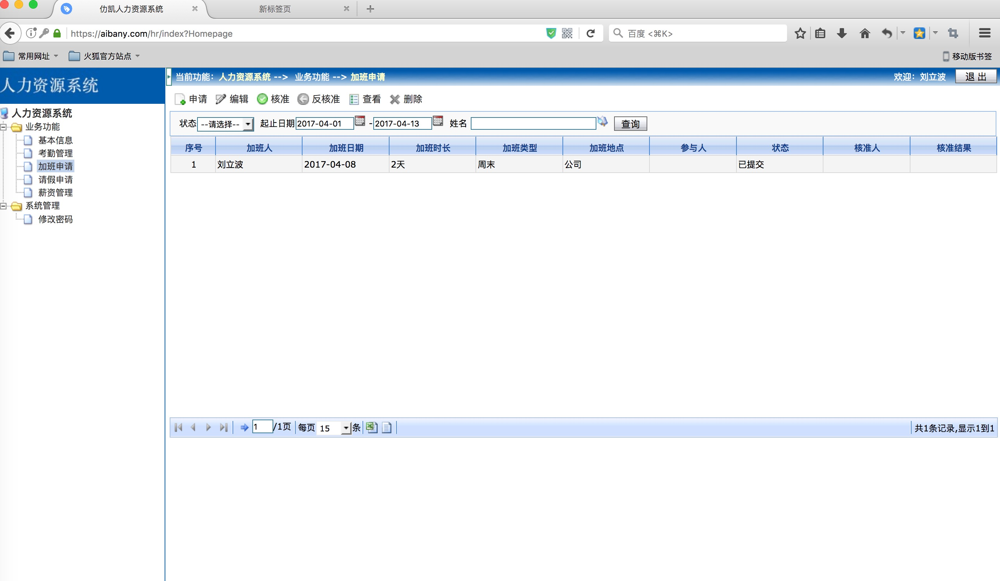

## aibanyHR系统说明
### 一、开发此系统的目的：

利用业余时间开发了此系统，主要用于解决中小企业的人事管理问题，简化其手工部分，实现传统公司的互联网化。

### 二、系统实现的功能：

1, 基础功能：登录、员工信息维护、考勤管理、加班管理、请假管理、薪资管理

2，高级功能：员工信心核准、考勤导出、加班核准、请假核准、薪资汇总等，支持各个维度数据的excel导出或pdf导出

3，系统功能：修改密码、组织结构管理(部门管理)、角色管理、权限管理(功能管理)、编码类型及值、系统日志、附件上传下载等

### 三、系统的角色说明：

1，`admin` ：此用户能管理员工信息、能管理组织结构、权限、角色、查看日志、管理编码、附件管理等

2，`普通用` ：能查看/编辑自己的信息，能考勤，查看所有人考勤，能申请加班/请假，能查看自己的薪资

3，`人事负责人`：具有普通用户的全部权限，另外，能添加员工、核准员工信息

4, `业务负责人` ：具有人事负责人的所有权限， 此外，能批准加班，能批准请假

5，`薪资负责人` ：具有人事负责人的所有权限，能汇总薪资，编辑员工薪资

### 四、项目开发环境

此项目基于eclipse + tomcat8.0.38 + mysql开发，开发、运行环境比较宽松。也可以用idea。

可以通过下载我们的[release版本](https://img.aibany.com:8090/release/)， 
```
关于工程导入eclipse:
 
首先clone代码， 

导入工程到eclipse: File->Import->Exsisting project into workspace

导入后，应该会有报错， 右键工程，Build path -> Configure Build path ，通过add Library -> add servertime
将你的tomcat lib加进来(一般在eclipse中添加tomcat后，就会有Apache Tomcat V8.0)， 

然后就确定，就OK了
```

### 五，项目部署

1, 创建数据库

```
CREATE DATABASE IF NOT EXISTS aeaihr DEFAULT CHARSET utf8 COLLATE utf8_general_ci;

```
2, 将aeaihr_mysql.sql导入到数据库中

3, 将hr.war放到tomcat目录/webapps/ 下， 重启tomcat

### 六，反馈

我们将收集大众的需求进行开发和维护，请联系邮箱fucusios@foxmail.com， 有任何问题也可以通过邮箱给我们留言，

我们提供QQ群进行交流：184961703

### 五、微信公众号配置说明：

1，需要申请服务号(企业)。 ”微信认证“可有可无。

2，登录微信公众号，点击基本资料，申请为开发者，创建AppSecret。

3,先将AppId和AppSecret，填入web.xml及MenuHelper.xml中, 将HOSTS更改为你自己的域名(注意全站http与https最好统一，否则https中携带http许多浏览器会报错)。 然后部署到远端服务器中

3，然后在微信公众号基本资料中，配置"服务器配置"，URL为域名+/hr/messagebroker Token为aibanyaeaihr，然后保存。

最终结果如下图:


#### 微信公众号菜单创建说明：

1，首先你需要有企业服务号

2，把MenuHelper中的aibany.com域名改成你自己的域名。

然后点击右键main， run as java application，即可。

微信客户端关注公众号后，即可看到创建的菜单。

` 目前已实现的功能有：扫码签到、定位签到、绑定账号、服务工具等 `

### 关于此项目的一些截图

#### admin看到的界面









#### 普通用户看到的界面





#### 业务负责人或hr或薪资管理员能看到的界面




